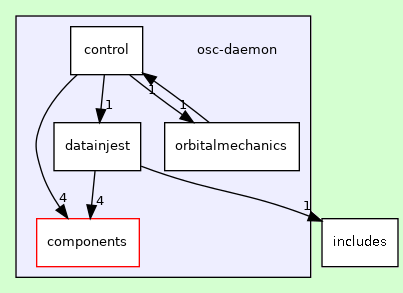
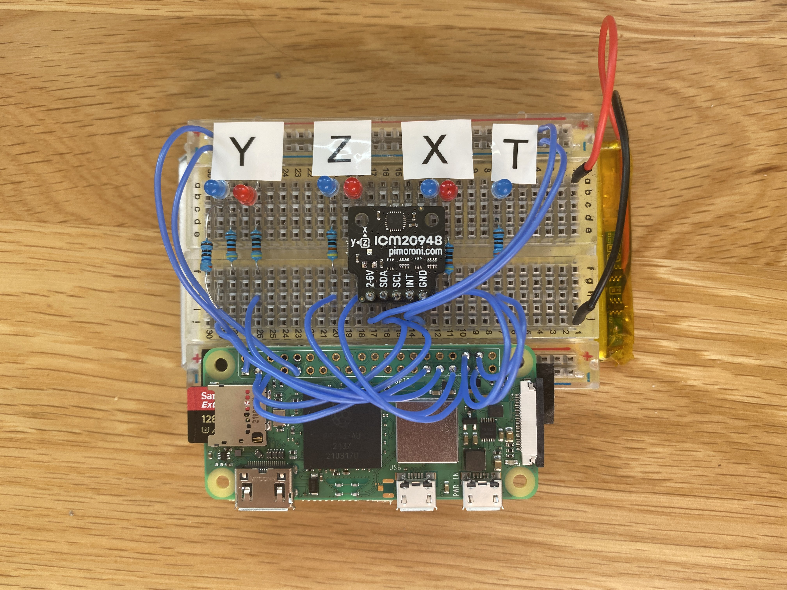

# openSatCon
We are a team of University of Glasgow students creating an open-source satellite control system for use in satellite applications, primarily micro-satellite users. The aim is to provide a lightweight modular system that can be adapted to fit the needs of numerous mission types.


### Status
<p><a href="LICENSE"></a>
<a href="https://github.com/oranellis/openSatCon/issues"></a>
 </a>

</p>

### Table of Contents
* [Feature List](#feature-list)
* [Requirements](#requirements)
* [openSatCon Installation](#opensatcon-installation)
* [How it works](#how-it-works)
* [FAQs](#faqs)
* [Social Media and Authors](#social-media-links-and-authors)

## Feature List
#### Essential
- Attitude Control and Pointing, including data logging
- Command Scheduler and Priority Handling for actions
- Orbital Calculations for pre-planned orbital manoeuvres 
#### Stretch Goals
- Ground Station Command Handling 
- Telemetry, Tracking, & Command Modelling
- Ground Station GUI w/ Orbit Visualisation
- Sensor Pointing Control

## Requirements
#### Satellite Requirements
- Satellite model, in prescribed json format
- Scheduled orbital manoeuvres (if applicable)
- Desired pointing location and hold attitude (if applicable)
#### Hardware Requirements
- IMU
- Microcontroller running latest version of Raspbian
- Satellite Attitude Determination and Control System 
- Satellite Thrusters (if applicable) 

## openSatCon Installation
Install <br/>
```sh
$ sudo make install
```
Clone the repository <br/>
```sh
$ git init 
$ git clone git@github.com:oranellis/openSatCon  
```
Build the repo<br/>
```sh
mkdir build
cd build
cmake ..
make    
./osc-daemon 
```
#### Documentation
To open the documentation <br/>
```sh
sudo apt install doxygen
```
Then in the openSatCon folder <br/>
```sh
doxygen config.conf
```
Open the index.html file in the html folder

## How it works
1. The software provides a basic framework to implement attitude determination and control systems and orbital manoeuvres onto their own satellite
2. A user includes interfaces between their particular satellite configuration, inputs, and outputs to the software
3. After the software and hardware are interfaced, the respective high-level commands can be called. This generates a task
4. A task is sent to the queue and based on the current satellite status, a task is chosen to complete.
5. This may involve sleeping to save power, waiting a short time to complete the task, completing the task, or even interrupt an ongoing task. This is based on priority of the tasks added to the queue.



The figure above shows the framework with which the software operates. The data injest folder is where the user inputs the satellite model and any data. This, alongside other folders, is read by the control folder, to obtain the satellite model and relevant dynamics and objects.


The control flow diagram can be seen in the figure above. The IMU inputs orientation data to the microprocessor. The microprocessor then exchanges information with the scheduler. The scheduler handles the priority of tasks and based on the input from the IMU, will make a decision to prioritze a given task. This could range from a simple pointing manoeuvre to a burn for orbital transfers. The scheduler then gives information to the microprocessor which will then give the appropriate commands to the thrusters, magnetorquers, and reaction wheels. It should be noted, the scheduler is not a physical component, but just an important part of the controller. 



The final hardware produced is seen above. This is only for demonstration purposes, as sending an actual satellite to space was out-of-budget. The satellite has reaction wheels and magnetorquers in the X, Y, and Z directions allowing for full 3D control. There is also a single thruster which is used for orbital calculations. When a task is processed and the commands are sent out to the actuators, which are represented by LEDs, the corresponding LED will light up. 


## FAQs
#### What does the software do?
The software provides a framework between satellite control and satellite input/output that should be adapted for the user's given problem.

#### What do I need to know about my satellite?
Satellite information is stored in a json file format, which includes important information of each of the components. For example, mass, moment of inertia, position of the object. This is completed for all mass objects, thrusters, fuel tanks, and rotators.

#### What are the outputs?
The software generates a series of commands at the control loop frequency (8kHz) which is stored in a map of commands. These are a series of actuator commands and have information on the thrust and the thrust fraction from 0 - 1 (ie, is the actuator running at full power) for each actuator. Commands are only generated while a task is running, to save power, based on real-time sensor input. These outputs are then interfaced through the microprocessor to the actuators.

#### How fast are the actuator commands?
The control loop takes 125us but a higher performance computer can go even faster. 125us is a very fast reaction, especially in orbit where communications towers may only be available for a few seconds. Although the time required to physically change attitude will be slightly longer, the control software is able to react to any disturbance very quickly.

## Social Media Links and Authors
[LinkTree](https://linktr.ee/openSatCon) &nbsp; &nbsp;[LinkedIn](https://linkedin.com/company/opensatcon) &nbsp; &nbsp;[Twitter](https://twitter.com/openSatCon) &nbsp; &nbsp;[Youtube](https://www.youtube.com/channel/UCqU7pj3qFMwDKtqEJbz2JTg)

[Oran Ellis](https://github.com/oranellis) &nbsp; &nbsp;[Aidan Macrae](https://github.com/2306781M) &nbsp; &nbsp;[Shreyas Raje](https://github.com/Shreylord)
