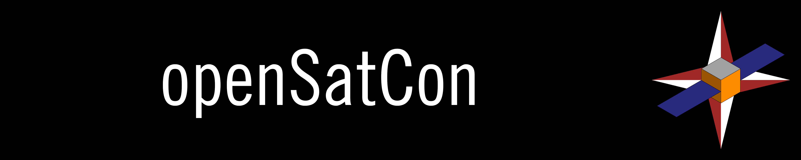
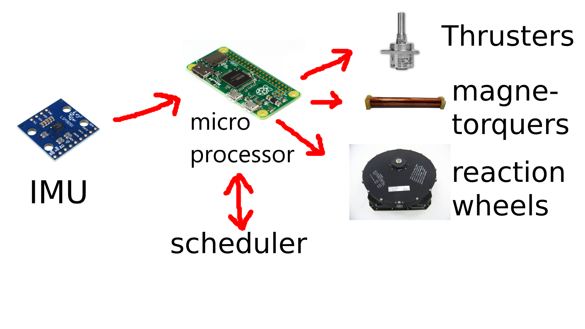

# openSatCon
We are a team of University of Glasgow students creating an open-source satellite control system for use in satellite applications, primarily micro-satellite users. The aim is to provide a lightweight modular system that can be adapted to fit the needs of numerous mission types.



### Status
<p><a href="LICENSE"></a>
<a href="https://github.com/oranellis/openSatCon/issues"></a> 

</p>

### Table of Contents
* [Feature List](#feature-list)
* [Requirements](#requirements)
* [openSatCon Installation](#opensatcon-installation)
* [How to Use](#how-to-use)
* [FAQs](#faqs)
* [Social Media and Authors](#social-media-links-and-authors)

## Feature List
#### Essential
- Attitude Control and Pointing, including data logging
- Command Scheduler and Priority Handling for actions
- Orbital Calculations for pre-planned orbital manoeuvres 
#### Stretch Goals
- Ground Station Command Handling 
- Telemetry, Tracking, & Command Modelling
- Ground Station GUI w/ Orbit Visualisation
- Sensor Pointing Control

## Requirements
#### Satellite Requirements
- Satellite model, in prescribed json format
- Scheduled orbital manoeuvres (if applicable)
- Desired pointing location and hold attitude (if applicable)
#### Hardware Requirements
- Satellite Controller with Linux
- IMU
- Microcontroller
- Satellite Attitude Determination and Control System 
- Satellite Thrusters (if applicable) 

## openSatCon Installation
Install <br/>
```sh
$ sudo make install
```
Clone the repository <br/>
```sh
$ git init 
$ git clone git@github.com:oranellis/openSatCon  
```
Build the repo<br/>
```sh
mkdir build
cd build
cmake ..
make    
./osc-daemon 
```
#### Documentation
To open the documentation <br/>
```sh
sudo apt install doxygen
```
Then in the openSatCon folder <br/>
```sh
doxygen config.conf
```
Open the index.html file in the html folder

## How it works


The control flow diagram can be seen in the figure above. The IMU inputs orientation data to the microcontroller. The microcontroller then exchanges information with the scheduler. The scheduler handles the priority of tasks and based on the input from the IMU, will make a decision to prioritze a given task. This could range from a simple pointing manoeuvre to a burn for orbital transfers. The scheduler then gives information to the microcontroller which will then give the appropriate commands to the thrusters, magnetorquers, and reaction wheels. It should be noted, the scheduler is not a physical component, but just an important part of the controller. 


## How to use
1. The control system is run with an input configuration of the satellite in the form of a json file. This json is given as a specific format and contains a template for all necessary parameters for the satellite that are required to make use of the control software.
2. Once the satellite file is input, the software requires desired pointing locations and/or orbital manoeuvres that are planned. The software does not facilitate live satellite-to-user commmunication, so only pre-planned manoevres will be scheduled. 
3. After the satellite model and planned manoeuvres are listed, the software will then complete all listed goals, holding attitude, pointing and orbital manoeuvres for the duration of the mission. 

## FAQs
- 

## Social Media Links and Authors
[LinkTree](https://linktr.ee/openSatCon) &nbsp; &nbsp;[LinkedIn](https://linkedin.com/company/opensatcon) &nbsp; &nbsp;[Twitter](https://twitter.com/openSatCon) &nbsp; &nbsp;[Youtube](https://www.youtube.com/channel/UCqU7pj3qFMwDKtqEJbz2JTg)

[Oran Ellis](https://github.com/oranellis) &nbsp; &nbsp;[Aidan Macrae](https://github.com/2306781M) &nbsp; &nbsp;[Shreyas Raje](https://github.com/Shreylord)
